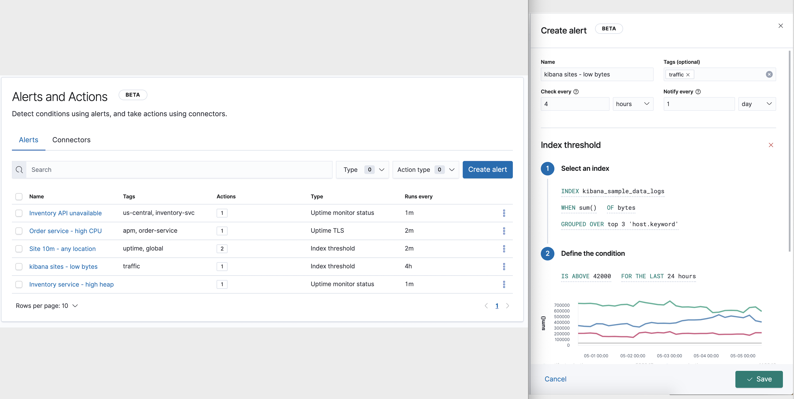

[](https://github.com/basavyr/kibana-log-alerts/actions/workflows/python-app.yml)

# Kibana Log Alerts

*Implementation of an alert system that will be used for computing clusters within a research department*

## Development Workflow ➡️

## Project goals: ⚙️

* Monitor logs from a compute cluster within a network.
* Parse the ingested logs into *friendly* format (e.g., easy to read and interpret).
* Analyze the logs in order to extract information that could help to further optimize the computing resources.
* Alert the management team when unusual behavior is detected via the monitoring stack.

## Description 📄

Log monitoring of multiple computing clusters is done through the [ELK stack](https://www.elastic.co/what-is/elk-stack). The logs ingested by Elasticsearch are mainly systems logs, network stats, and information related to different services running on the machines.

A computing cluster is managed by a *central node* which collects all the individual logs, then finally sends them (via *Filebeat*) to a dedicated *ingest pipeline*. The pipeline consists in a running Logstash instance that is configured on a separate virtual machine. Elasticsearch stores the logs into documents that are finally analysed by the management team through Kibana.

Proper log analysis must be done in real-time, with uninterrupted monitoring, due to non-stop runtime of the actual compute resources. 
Detection of any malfunction, unexpected or even suboptimal behavior must be identified almost immediately. In order to facilitate this, automated systems that are triggered when the mentioned issues might arise can be implemented within the log monitoring&analysis pipeline.

As such, **an alert system** which triggers messages with corresponding issues needs to be implemented using available services/applications/packages.

## Alert Implementation ⚠️

Two possible ways of implementing the required workflow are available. These solutions are described below and both are implemented in the current project.

### Alerts with Kibana

Kibana allows one to set up an alert system via the new [`X-Pack` feature](https://www.elastic.co/guide/en/kibana/current/alerting-getting-started.html).

*Kibana UI showing the alert + action feature.*
> #### What is an alert?  
> An alert specifies a background task that runs on the Kibana server to check for specific conditions. It consists of three main parts:  
> * **Conditions:** what needs to be detected?  
> * **Schedule:** when/how often should detection checks run?  
> * **Actions:** what happens when a condition is detected?  
> For example, when monitoring a set of servers, an alert might check for average CPU usage > 0.9 on each server for the two minutes (condition), checked every minute (schedule), sending a warning email message via SMTP with subject CPU on {{server}} is high (action).

### Alerts with Python

Another approach would be the use of different packages and modules within a modern programming language. Python is quite probably the most reliable solution which can be developed, since it offers great compatibility across different platforms, systems, and compute architectures.

As such, development of a workflow which is completely capable of reading, analyzing and deciding if the incoming logs exhibit either *normal* ✅ or *unusual* ❌ behavior. This needs to happen in real-time, while the logs are sent to the main Logstash pipeline via Filebeat.

Modules such as:

```python
# import file watcher module
from watchdog.observers import Observer
from watchdog.events import FileSystemEventHandler
# import modules for sending e-mails
import email, smtplib, ssl
```
are used throughout the development process of the Python codebase. Preferred method of alerting inside the Python implementation is via e-mail. A list of pre-configured clients will be alerted if needed, based on the analysis of incoming logs over a certain amount of time, after they were compared to the set of parameters that are considered to be normal.

## Workflow Diagrams 📉